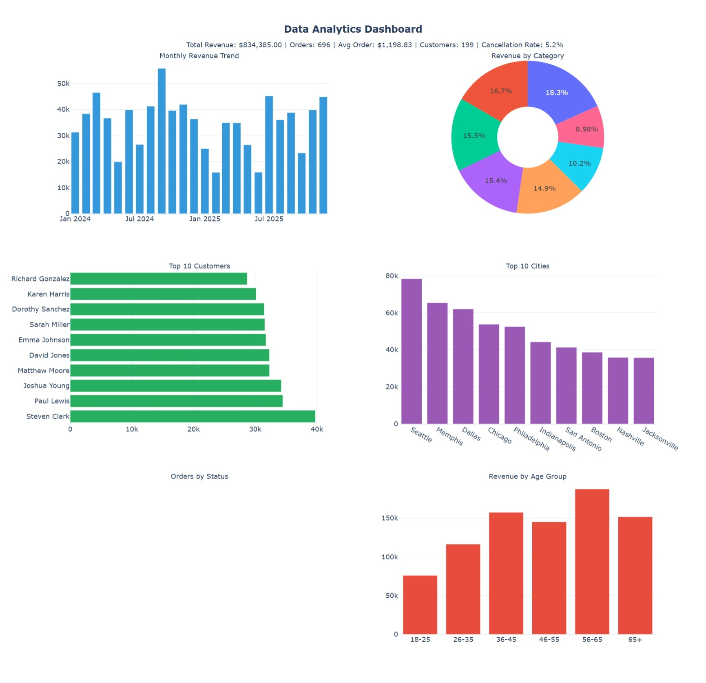

# Data Analytics and Visualization Dashboard

A comprehensive data analytics project built with Python, Pandas, Excel, and visualization tools.

## Features

- **Large-scale Dataset Analysis**: Analyzed 200+ customers, 49 products, and 1000+ orders
- **Interactive Dashboards**: Built using Plotly for customer analysis and business insights
- **Data Mining & Statistical Analysis**: Trend identification, RFM analysis, customer segmentation
- **Data Backup & Recovery**: Automated backup procedures ensuring data integrity
- **Reports**: Generated strategic reports from multiple data sources

## Technologies Used

- Python
- Pandas
- Excel
- Plotly Dash
- SQL
- HTML/JavaScript

## Project Structure

```
dataanlysisi 2/
├── data/              # Dataset and generator
├── analysis/          # Pandas analysis scripts & reports
├── sql/              # SQL schema and queries
├── dashboard/        # Interactive dashboards
└── backup/           # Backup and recovery tools
```

## Running the Project

### 1. Run Data Analysis
```bash
python analysis/data_analysis.py
```

### 2. View Dashboard
Open `dashboard/dashboard.html` in a web browser

### 3. Interactive Dashboard (Dash)
```bash
python dashboard/dashboard.py
# Open http://localhost:8050
```

### 4. Backup & Recovery
```bash
python backup/backup_recovery.py
```

## Key Analytics

- **Total Revenue**: $1,180,132
- **Total Orders**: 1,000
- **Cancellation Rate**: 5.2%
- **Top Customer**: Betty Young ($18,461)
- **Top Category**: Toys ($215,727)

## Dashboard Screenshot

